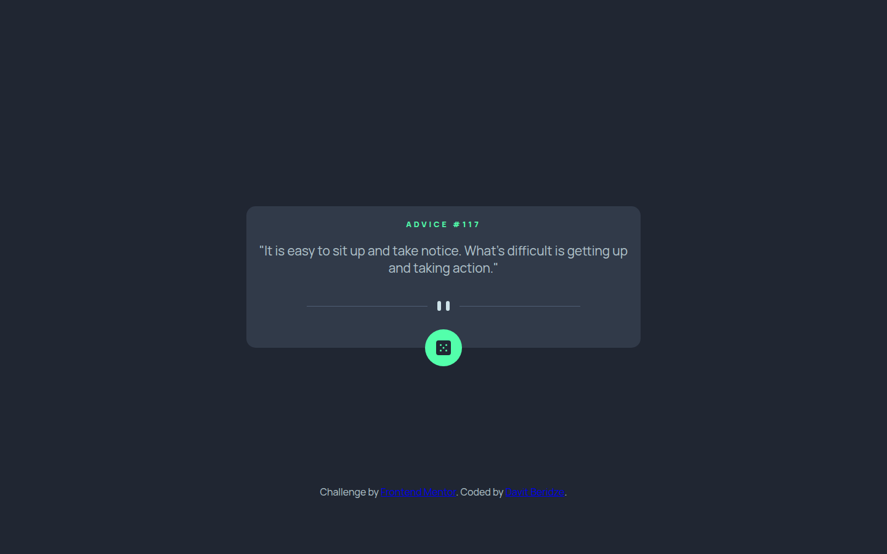
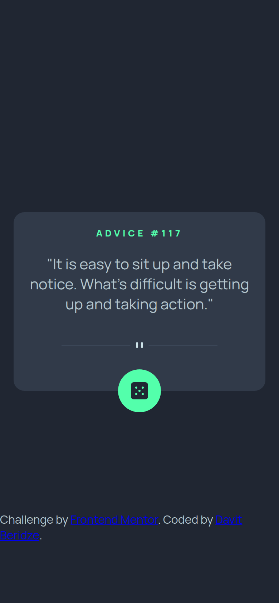

# Advice Generator App

My solution to the [Advice generator app](https://www.frontendmentor.io/challenges/advice-generator-app-QdUG-13db) challenge on Frontend Mentor. Shows a random piece of advice from the [Advice Slip API](https://api.adviceslip.com/) and fetches a new one on each click of the dice button.





## Features

- Loads a random piece of advice when the page opens
- Dice button requests new advice
- Displays the advice number from the API
- Responsive card layout

## Built with

- Semantic HTML
- CSS with Flexbox and media queries
- JavaScript Fetch API

## Run locally

No build step or dependencies. Open `index.html` in a browser, or serve the folder:

```bash
npx serve .
```
